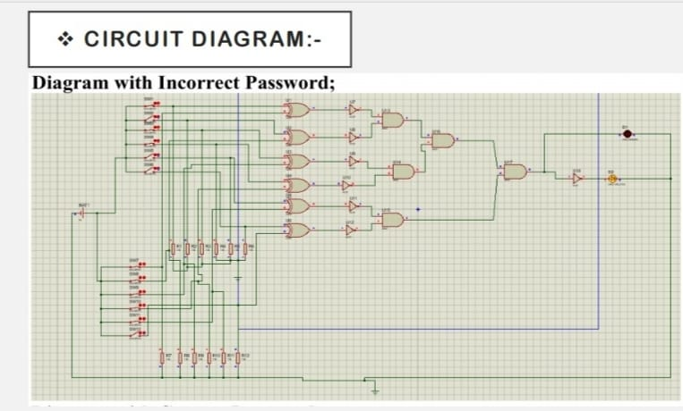
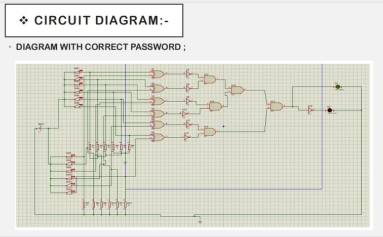

📌 6-Bit Password Security System Using Logic Gates

(XOR, NOT & AND Gates)

📖 Introduction

This project demonstrates a basic hardware-based authentication system designed using combinational digital logic. A 6-bit password acts as a key to unlock a secure output.

✔ Circuit Diagram
## 📸 photos

🎯 Objective

✔ Implement a password-based verification system using only basic logic circuits
✔ Demonstrate practical security logic using XOR, NOT & AND gates
✔ Develop confidence in digital electronics, truth table implementation & circuit building

🧠 Working Principle

The system works on bitwise comparison:

Gate	Purpose
XOR Gate	Compares each user input bit with stored password bit. Output = 0 if equal, 1 if different
NOT Gate	Converts XOR result so correct matches become logic 1
AND Gate	Checks if all bits match (all inputs must be 1 to unlock)

Final Condition for Access:
➡ All six comparisons must be correct → AND output = 1 → Unlock LED ON

If even one bit mismatches → AND output = 0 → Alarm (Red LED/Buzzer) ON.

🔧 Components Used
S.No	Component	Quantity
1.	XOR IC – 74HC86	2
2.	NOT IC – 74HC04	2
3.	AND IC – 74HCT08	2
4.	Resistors 1kΩ	12
5.	LEDs (Green & Red)	2
6.	Buzzer (optional)	1
7.	DIP 6-Bit Switches (Input + Stored Code)	2
8.	Breadboard	2
9.	Jumper Wires	As Required
10.	5V DC Power Supply	1

🧩 Connections (Brief)

1️⃣ Each of the 6 user's input bits → one XOR input
2️⃣ Corresponding stored key bits → other XOR input
3️⃣ XOR output → NOT gate input
4️⃣ All NOT outputs → Single AND gate inputs
5️⃣ AND output → Green LED (correct password indication)
6️⃣ AND output also inverted → Red LED/Buzzer (wrong password)

🔍 Example Operation

Stored Password: 101010
User Input: 101010 → All XOR = 0 → NOT outputs = 1 → AND = 1 (Unlock 🔓)

User Input: 101110 → One bit differs → AND = 0 (Alarm 🔔)
📚 References

Digital Logic Design Textbooks (Combinational Circuit Design)

Logic Gate IC Datasheets (74HC86 / 74HC04 / 74HCT08)

## 👨‍💻 Author
Aman kumar